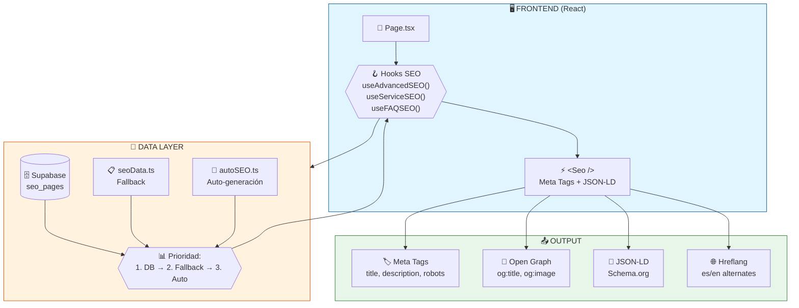
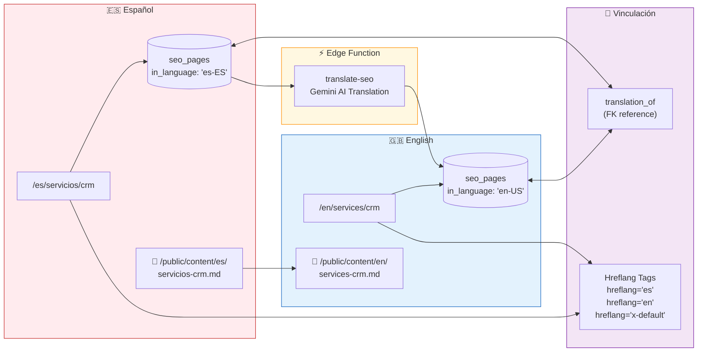
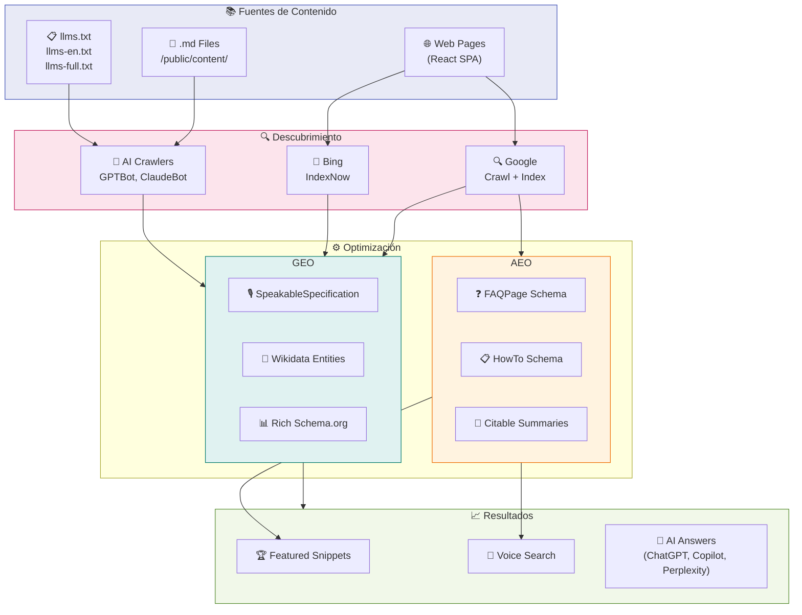
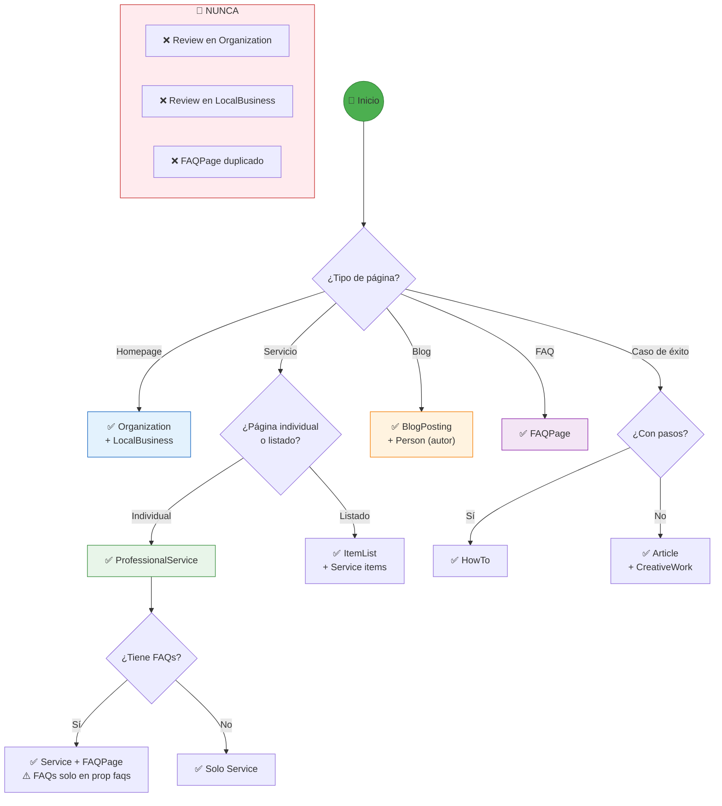
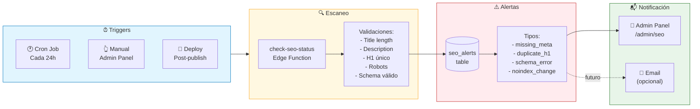
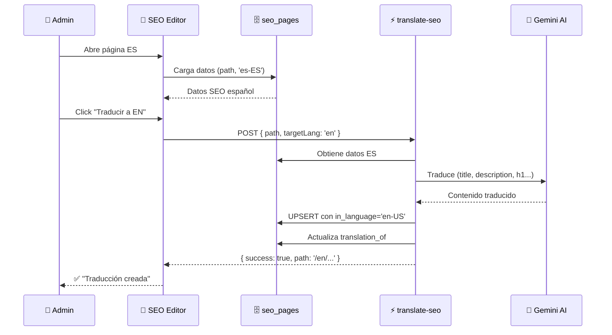

# 📊 SEO System Overview - Hayas Marketing

> **Documento Maestro de Arquitectura SEO**  
> Versión: 1.0  
> Última actualización: 2026-02-08

---

## 📑 Índice

1. [Visión General](#1-visión-general)
2. [Arquitectura del Sistema](#2-arquitectura-del-sistema)
3. [Componentes Principales](#3-componentes-principales)
4. [Hooks SEO](#4-hooks-seo)
5. [Base de Datos SEO](#5-base-de-datos-seo)
6. [Schema.org - Árbol de Decisión](#6-schemaorg---árbol-de-decisión)
7. [Sistema Multilingüe](#7-sistema-multilingüe)
8. [GEO - Generative Engine Optimization](#8-geo---generative-engine-optimization)
9. [AEO - Answer Engine Optimization](#9-aeo---answer-engine-optimization)
10. [E-E-A-T Implementation](#10-e-e-a-t-implementation)
11. [Flujo de Datos SEO](#11-flujo-de-datos-seo)
12. [Sistema de Alertas](#12-sistema-de-alertas)
13. [IndexNow Protocol](#13-indexnow-protocol)
14. [Documentación Relacionada](#14-documentación-relacionada)

---

## 📊 Diagramas de Arquitectura (Exportables)

> **Cómo exportar**: Copia el código Mermaid y pégalo en [mermaid.live](https://mermaid.live) para exportar como PNG/SVG.

### Diagrama 1: Flujo de Datos SEO Principal



### Diagrama 2: Sistema Multilingüe SEO



### Diagrama 3: GEO/AEO Stack



### Diagrama 4: Árbol de Decisión de Schemas



### Diagrama 5: Sistema de Alertas y Monitoreo



### Diagrama 6: Flujo de Traducción SEO



---

## 1. Visión General

### Objetivo del Sistema SEO

El sistema SEO de Hayas Marketing está diseñado para:

1. **SEO Clásico**: Optimización para Google/Bing (crawlers tradicionales)
2. **AEO (Answer Engine Optimization)**: Optimización para Featured Snippets y respuestas directas
3. **GEO (Generative Engine Optimization)**: Optimización para IAs generativas (ChatGPT, Copilot, Perplexity, Gemini)

### Stack Tecnológico

| Capa | Tecnología | Propósito |
|------|-----------|-----------|
| Frontend | React + TypeScript | Renderizado SPA con SEO dinámico |
| SEO Component | `Seo.tsx` | Inyección de meta tags y JSON-LD |
| Hooks | Custom hooks (`useAdvancedSEO`, etc.) | Lógica SEO reutilizable |
| Base de Datos | Supabase `seo_pages` | Almacenamiento centralizado de metadatos |
| Fallback | `seoData.ts` | Datos SEO hardcoded como respaldo |
| Edge Functions | `generate-seo-suggestions`, `translate-seo` | Generación IA y traducción |
| GEO/AEO | Ficheros `.md` en `/public/content/` | Contenido optimizado para IAs |

---

## 2. Arquitectura del Sistema

```
┌─────────────────────────────────────────────────────────────────────────┐
│                           FRONTEND (React)                               │
├─────────────────────────────────────────────────────────────────────────┤
│                                                                          │
│   ┌─────────────┐     ┌──────────────────┐     ┌─────────────────────┐  │
│   │ Page.tsx    │────▶│ useAdvancedSEO() │────▶│     <Seo />         │  │
│   │ (Component) │     │ useServiceSEO()  │     │ (Meta + JSON-LD)    │  │
│   └─────────────┘     │ useFAQSEO()      │     └─────────────────────┘  │
│                       │ useArticleSEO()  │                              │
│                       │ useHowToSEO()    │                              │
│                       └──────────────────┘                              │
│                                │                                        │
│                                ▼                                        │
│                       ┌──────────────────┐                              │
│                       │   useSEOPage()   │◀──── React Query Cache       │
│                       └──────────────────┘                              │
│                                │                                        │
└────────────────────────────────┼────────────────────────────────────────┘
                                 │
                                 ▼
┌─────────────────────────────────────────────────────────────────────────┐
│                          DATA LAYER                                      │
├─────────────────────────────────────────────────────────────────────────┤
│                                                                          │
│   ┌──────────────────────────────┐     ┌────────────────────────────┐   │
│   │      Supabase DB             │     │    seoData.ts (Fallback)   │   │
│   │   ┌─────────────────────┐    │     │  ┌──────────────────────┐  │   │
│   │   │     seo_pages       │    │     │  │ getSEOData(path)     │  │   │
│   │   │ (path, in_language) │    │     │  │ generateServiceSchema│  │   │
│   │   │ (title, h1, desc)   │    │     │  │ generateFAQSchema    │  │   │
│   │   │ (keywords, robots)  │    │     │  │ generateArticleSchema│  │   │
│   │   │ (faqs, schema_type) │    │     │  │ generateHowToSchema  │  │   │
│   │   └─────────────────────┘    │     │  └──────────────────────┘  │   │
│   └──────────────────────────────┘     └────────────────────────────┘   │
│              │                                      │                   │
│              └──────────────┬───────────────────────┘                   │
│                             ▼                                           │
│                   ┌─────────────────────┐                               │
│                   │    Prioridad:       │                               │
│                   │ 1. Supabase DB      │                               │
│                   │ 2. seoData.ts       │                               │
│                   │ 3. autoSEO.ts       │                               │
│                   └─────────────────────┘                               │
│                                                                          │
└─────────────────────────────────────────────────────────────────────────┘
                                 │
                                 ▼
┌─────────────────────────────────────────────────────────────────────────┐
│                          GEO/AEO LAYER                                   │
├─────────────────────────────────────────────────────────────────────────┤
│                                                                          │
│   ┌─────────────────────────────────────────────────────────────────┐   │
│   │                    /public/content/                              │   │
│   │   ┌─────────────────────┐     ┌─────────────────────────────┐   │   │
│   │   │        /es/         │     │           /en/               │   │   │
│   │   │  ├── servicios/     │     │    ├── services/             │   │   │
│   │   │  ├── soluciones/    │     │    ├── solutions/            │   │   │
│   │   │  ├── casos-exito/   │     │    └── general/              │   │   │
│   │   │  └── general/       │     │                              │   │   │
│   │   └─────────────────────┘     └─────────────────────────────┘   │   │
│   │                                                                  │   │
│   │   Estructura de cada .md:                                        │   │
│   │   - IA_SUMMARY (60-80 palabras)                                 │   │
│   │   - Resumen AEO citable                                         │   │
│   │   - Metadatos E-E-A-T                                           │   │
│   │   - Secciones semánticas                                        │   │
│   └─────────────────────────────────────────────────────────────────┘   │
│                                                                          │
│   ┌─────────────────────────────────────────────────────────────────┐   │
│   │                    llms.txt & llms-en.txt                        │   │
│   │   - Índice completo para crawlers IA                            │   │
│   │   - Estructura empresa, servicios, FAQs                         │   │
│   │   - URLs principales y contacto                                 │   │
│   └─────────────────────────────────────────────────────────────────┘   │
│                                                                          │
└─────────────────────────────────────────────────────────────────────────┘
```

---

## 3. Componentes Principales

### 3.1 Seo.tsx

**Ubicación**: `src/components/Seo.tsx`

El componente central que inyecta todos los meta tags y structured data en el DOM.

```typescript
interface SeoProps {
  title: string;
  description?: string;
  keywords?: string[];
  canonical?: string;
  structuredData?: Record<string, any> | Array<Record<string, any>>;
  ogImage?: string;
  ogType?: 'website' | 'article' | 'service';
  inLanguage?: string;
  about?: string[];
  mentions?: string[];
  faqs?: Array<{ question: string; answer: string }>;
  robots?: string;
}
```

**Schemas generados automáticamente**:

| Schema | Condición | Notas |
|--------|-----------|-------|
| `Organization` | Siempre | `hayasOrganizationSchema` incluido en todas las páginas |
| `BreadcrumbList` | Cuando `canonical` tiene más de un segmento | Navegación estructurada |
| `FAQPage` | Cuando se pasa prop `faqs` | **NO pasar también en `structuredData`** |

**Regla Crítica**: Nunca duplicar schemas que `Seo.tsx` genera automáticamente. Ver [Bug #3 en Critical Bugs](./SEO_CRITICAL_BUGS_AND_FIXES.md#bug-3-faqpage-schema-duplicado).

### 3.2 EnhancedSEO.tsx

**Ubicación**: `src/components/EnhancedSEO.tsx`

Wrapper de alto nivel que utiliza `useAdvancedSEO` para auto-extracción de conceptos y validación.

```typescript
<EnhancedSEO
  customSEO={{ title: "Custom Title" }}
  pageContent="Contenido de la página para extracción..."
  showValidationWarnings={process.env.NODE_ENV === 'development'}
/>
```

### 3.3 seoData.ts

**Ubicación**: `src/data/seoData.ts`

Archivo central con:
- `hayasOrganizationSchema`: Schema de empresa (Organization + LocalBusiness)
- `seoData`: Mapa de rutas a datos SEO hardcoded
- Helpers para generar schemas dinámicos

**Funciones Generadoras**:

| Función | Schema Generado | Uso |
|---------|-----------------|-----|
| `generateServiceSchema()` | `ProfessionalService` | Páginas de servicios individuales |
| `generateItemListSchema()` | `ItemList` | Listados de servicios, casos de éxito |
| `generateHowToSchema()` | `HowTo` | Guías paso a paso |
| `generateArticleSchema()` | `BlogPosting` | Artículos de blog |
| `generateFAQSchema()` | `FAQPage` | Preguntas frecuentes |
| `createBlogArticleSchema()` | `Article` | Blog posts con E-E-A-T |

---

## 4. Hooks SEO

### 4.1 useAdvancedSEO

**Ubicación**: `src/hooks/useAdvancedSEO.ts`

Hook principal que combina datos de DB + fallback + auto-generación.

```typescript
const seoData = useAdvancedSEO({
  customSEO: { title: "Override Title" },
  pageContent: "Texto para extracción de conceptos",
  skipAutoExtraction: false
});
```

**Flujo de prioridad**:
1. ✅ Datos de Supabase `seo_pages` (si existen)
2. ✅ Datos de `seoData.ts` (fallback)
3. ✅ Auto-generación con `autoSEO.ts`

### 4.2 useSEOPage

**Ubicación**: `src/hooks/useSEOData.ts`

Hook de React Query para obtener datos SEO desde la base de datos.

```typescript
const { data, isLoading } = useSEOPage('/es/servicios/diseno-web', 'es-ES');
// data.source: 'database' | 'fallback'
// data.data: EnhancedPageSEOData
```

### 4.3 useServiceSEO

**Ubicación**: `src/hooks/useServiceSEO.ts`

Hook especializado para páginas de servicios con Service Schema.

```typescript
const seo = useServiceSEO({
  serviceName: "Diseño Web Profesional",
  serviceDescription: "Descripción optimizada...",
  canonical: "/es/servicios/diseno-web",
  serviceType: "Web Development",
  priceRange: "€€€",
  features: ["UX/UI", "Responsive", "SEO"],
  aggregateRating: { ratingValue: "4.9", reviewCount: "28" }
});
```

### 4.4 useFAQSEO

**Ubicación**: `src/hooks/useFAQSEO.ts`

Hook para generar FAQ Schema optimizado para Featured Snippets.

```typescript
const { structuredData } = useFAQSEO({
  faqs: [
    { question: "¿Cuánto cuesta...?", answer: "El precio varía..." }
  ],
  pageUrl: '/es/servicios/diseno-web'
});
```

### 4.5 useHowToSEO

**Ubicación**: `src/hooks/useHowToSEO.ts`

Hook para guías paso a paso con HowTo Schema.

```typescript
const seo = useHowToSEO({
  howToName: "Cómo configurar HubSpot CRM",
  howToDescription: "Guía completa paso a paso...",
  canonical: "/es/blog/configurar-hubspot",
  steps: [
    { name: "Crear cuenta", text: "Accede a hubspot.com..." }
  ],
  totalTime: "PT30M"
});
```

### 4.6 useArticleSEO

**Ubicación**: `src/hooks/useArticleSEO.ts`

Hook para artículos de blog con Article Schema.

```typescript
const seo = useArticleSEO({
  headline: "10 Estrategias de Marketing Digital",
  description: "Las tendencias más importantes...",
  canonical: "/es/blog/estrategias-marketing",
  author: { name: "Rubén Reyero", url: "/es/autor/ruben-reyero" },
  datePublished: "2026-01-15",
  dateModified: "2026-02-01"
});
```

### 4.7 useGenerateSEO

**Ubicación**: `src/hooks/useGenerateSEO.ts`

Hook para generar sugerencias SEO con IA (Gemini/OpenAI).

```typescript
const { generateSEO, suggestions, isGenerating } = useGenerateSEO();

await generateSEO({
  path: '/es/servicios/nuevo-servicio',
  pageContent: "Contenido de la página...",
  targetLanguage: 'es' // auto-detectado desde path
});
```

---

## 5. Base de Datos SEO

### 5.1 Tabla `seo_pages`

Tabla principal para almacenamiento centralizado de metadatos SEO.

```sql
CREATE TABLE seo_pages (
  id UUID PRIMARY KEY,
  path TEXT NOT NULL,
  in_language TEXT DEFAULT 'es-ES', -- 'es-ES' | 'en-US'
  
  -- Campos críticos
  title TEXT NOT NULL,
  description TEXT NOT NULL,
  h1 TEXT NOT NULL,
  canonical TEXT NOT NULL,
  
  -- Campos recomendados
  keywords JSONB DEFAULT '[]',
  og_image TEXT,
  og_type TEXT DEFAULT 'website',
  robots TEXT DEFAULT 'index,follow',
  
  -- Headings
  h2_primary TEXT,
  h2_secondary JSONB DEFAULT '[]',
  h3_strategic JSONB DEFAULT '[]',
  
  -- Schema
  schema_type TEXT DEFAULT 'WebPage',
  faqs JSONB DEFAULT '[]',
  additional_schema JSONB,
  
  -- Metadata
  category TEXT DEFAULT 'main',
  is_indexable BOOLEAN DEFAULT true,
  translation_of UUID REFERENCES seo_pages(id),
  
  -- Timestamps
  created_at TIMESTAMPTZ DEFAULT now(),
  updated_at TIMESTAMPTZ DEFAULT now(),
  last_optimized_at TIMESTAMPTZ,
  
  -- Constraint único
  UNIQUE(path, in_language)
);
```

**Constraint de idioma**: El campo `in_language` solo acepta `es-ES` o `en-US` (CHECK constraint).

### 5.2 Tabla `seo_history`

Snapshots históricos para detección de cambios.

```sql
CREATE TABLE seo_history (
  id UUID PRIMARY KEY,
  page_path TEXT NOT NULL,
  seo_optimized BOOLEAN,
  missing_fields_count INTEGER,
  missing_fields JSONB,
  status TEXT,
  snapshot_at TIMESTAMPTZ DEFAULT now()
);
```

### 5.3 Tabla `seo_alerts`

Alertas automáticas de problemas SEO.

```sql
CREATE TABLE seo_alerts (
  id UUID PRIMARY KEY,
  alert_type TEXT NOT NULL, -- 'new_page_no_seo', 'optimization_lost', etc.
  severity TEXT DEFAULT 'info', -- 'info', 'warning', 'critical'
  page_path TEXT NOT NULL,
  message TEXT NOT NULL,
  details JSONB,
  is_read BOOLEAN DEFAULT false,
  created_at TIMESTAMPTZ DEFAULT now(),
  resolved_at TIMESTAMPTZ
);
```

---

## 6. Schema.org - Árbol de Decisión

```
¿Qué tipo de página es?
│
├─► Homepage (/, /en)
│   └─► WebSite + Organization + FAQPage
│
├─► Página de Servicio (/es/servicios/*)
│   └─► ProfessionalService + FAQPage (opcional)
│       ├─► Usar useServiceSEO()
│       └─► aggregateRating solo si hay reviews reales
│
├─► Página de Solución (/es/soluciones/*)
│   └─► Service + ItemList (si lista servicios)
│
├─► Listado (casos de éxito, servicios)
│   └─► ItemList + WebPage
│       └─► Usar generateItemListSchema()
│
├─► Artículo de Blog (/es/blog/*)
│   └─► Article (BlogPosting) + FAQPage (opcional)
│       ├─► Usar useArticleSEO()
│       └─► Incluir author con URL de perfil
│
├─► Guía/Tutorial
│   └─► HowTo + WebPage
│       └─► Usar useHowToSEO()
│
├─► Caso de Éxito Individual
│   └─► WebPage (sin canonical a listado)
│
├─► Página de Autor
│   └─► AboutPage + Person
│       └─► Incluir SpeakableSpecification
│
└─► Otras páginas
    └─► WebPage genérico
```

### Schemas que NUNCA usar en Organization/LocalBusiness

| Schema | Motivo |
|--------|--------|
| `aggregateRating` | Política "self-serving" de Google (2019) |
| `review` | Solo permitido con reseñas de terceros (Google Reviews, Trustpilot) |

---

## 7. Sistema Multilingüe

### 7.1 Arquitectura Bilingüe

```
/es/*  ─────────────────────────────────────────┐
       │ LanguageContext                        │
       │ detecta idioma desde pathname          │
       ▼                                        │
   ┌─────────────────────────────────────────┐  │
   │ in_language: 'es-ES'                    │  │
   │ Contenido en español                    │  │
   │ Canonical: self                         │  │
   │ hreflang: es, en, x-default             │  │
   └─────────────────────────────────────────┘  │
                                                │
/en/*  ─────────────────────────────────────────┤
       │                                        │
       ▼                                        │
   ┌─────────────────────────────────────────┐  │
   │ in_language: 'en-US'                    │  │
   │ Contenido en inglés                     │  │
   │ Canonical: self                         │  │
   │ hreflang: es, en, x-default             │  │
   └─────────────────────────────────────────┘  │
                                                │
       ┌────────────────────────────────────────┘
       │
       ▼
   ┌─────────────────────────────────────────┐
   │ translation_of: UUID                    │
   │ Vincula versiones ES ↔ EN              │
   │ Permite sincronización                  │
   └─────────────────────────────────────────┘
```

### 7.2 LanguageContext

**Ubicación**: `src/contexts/LanguageContext.tsx`

```typescript
const { language, languageCode, isEnglish, isSpanish } = useLanguage();
// language: 'es' | 'en'
// languageCode: 'es-ES' | 'en-US'
```

**Regla Crítica**: La raíz `/` **SIEMPRE** redirige a `/es`, nunca basarse en `navigator.language`. Ver [Bug #1 en Critical Bugs](./SEO_CRITICAL_BUGS_AND_FIXES.md#bug-1-homepage-no-indexable-por-detección-de-idioma).

### 7.3 Hreflang Tags

`Seo.tsx` genera automáticamente los hreflang tags:

```html
<link rel="alternate" hreflang="es" href="https://hayasmarketing.com/es/servicios/diseno-web" />
<link rel="alternate" hreflang="en" href="https://hayasmarketing.com/en/services/web-design" />
<link rel="alternate" hreflang="x-default" href="https://hayasmarketing.com/es/servicios/diseno-web" />
```

### 7.4 Edge Function: translate-seo

**Ubicación**: `supabase/functions/translate-seo/`

Traduce automáticamente metadatos SEO de ES→EN o EN→ES.

```typescript
// Invocación
await supabase.functions.invoke('translate-seo', {
  body: {
    sourcePath: '/es/servicios/diseno-web',
    targetLanguage: 'en'
  }
});
```

**Comportamiento**:
- Copia `og_image` de origen a destino
- Adapta el idioma (no traduce literal)
- Mantiene la estructura de headings
- Vincula mediante `translation_of`

### 7.5 Flujo de Trabajo Bilingüe

1. **Crear página en español** → Guardar en `seo_pages` con `in_language: 'es-ES'`
2. **Generar versión inglesa** → Usar botón "Traducir a EN" en editor SEO
3. **Edge Function** → Traduce y crea entrada con `in_language: 'en-US'`
4. **Vinculación** → `translation_of` conecta ambas versiones

---

## 8. GEO - Generative Engine Optimization

### 8.1 ¿Qué es GEO?

**Generative Engine Optimization** es la optimización para motores de IA generativa como:

| Plataforma | Motor | Crawler |
|------------|-------|---------|
| ChatGPT | OpenAI | GPTBot |
| Microsoft Copilot | Bing + OpenAI | Bingbot |
| Perplexity | Perplexity AI | PerplexityBot |
| Google AI Overview | Gemini | Googlebot |
| Claude | Anthropic | Claude-Web |

### 8.2 Infraestructura GEO Implementada

#### 8.2.1 Ficheros .md para IA

**Ubicación**: `/public/content/`

```
public/content/
├── es/
│   ├── servicios/
│   │   ├── creacion-marca.md
│   │   ├── diseno-web.md
│   │   ├── seo-posicionamiento.md
│   │   └── ... (10 servicios)
│   ├── soluciones/
│   │   ├── impulsa-tu-marca.md
│   │   ├── conecta-con-tus-clientes.md
│   │   └── activa-tus-ventas.md
│   ├── casos-exito/
│   │   ├── asendia.md
│   │   ├── hubspot-for-startups.md
│   │   └── ... (15+ casos)
│   └── general/
│       ├── empresa.md
│       └── metodologia.md
│
└── en/
    ├── services/
    ├── solutions/
    └── general/
```

#### 8.2.2 Estructura de Ficheros .md

Cada fichero sigue un estándar estricto:

```markdown
<!--
IA_SUMMARY:
[Qué es]: Servicio de diseño web profesional con metodología UX/UI
[Para quién]: Empresas B2B y B2C que necesitan presencia digital efectiva
[Qué incluye]: Análisis, diseño, desarrollo, optimización SEO, hosting
[Resultado]: Web corporativa que convierte visitantes en clientes
-->

---
Título: Diseño Web Profesional
Slug: diseno-web
Categoría: servicio
Última actualización: 2026-02-06
Versión: 2.1
Autor: Hayas Marketing
Intención de búsqueda: transaccional
Keywords objetivo: diseño web profesional, desarrollo web, agencia diseño web
---

# Diseño Web Profesional

## Resumen AEO

> Hayas Marketing ofrece servicios de diseño web profesional con enfoque UX/UI, 
> optimización SEO integrada y desarrollo responsive. Nuestro proceso incluye 
> análisis estratégico, prototipado, desarrollo y formación del equipo.

## ¿Qué ofrecemos?
...

## Casos de Éxito Relacionados
- [Nexo Vital](/es/casos-exito/nexo-vital) - Web corporativa B2B
- [Buhobike](/es/casos-exito/buhobike) - E-commerce
...
```

#### 8.2.3 llms.txt - Índice para IAs

**Ubicación**: `/public/llms.txt` y `/public/llms-en.txt`

Archivo de índice completo (~600 líneas) que incluye:

- Metadatos de empresa
- Descripción de servicios
- Tecnologías y herramientas
- FAQs completas
- URLs de contacto
- Casos de uso comunes

```markdown
# Hayas Marketing - LLM Context File

> Agencia de Marketing Digital especializada en IA, CRM y Automatización

## Metadata
- **Company**: Hayas Marketing
- **Website**: https://hayasmarketing.com
- **Founded**: 2014
- **Last Updated**: 2026-02-04

## Servicios Principales
...
```

### 8.3 Optimizaciones GEO Específicas

#### 8.3.1 SpeakableSpecification

Implementado en páginas de autor y artículos importantes:

```typescript
{
  "@type": "Article",
  "speakable": {
    "@type": "SpeakableSpecification",
    "cssSelector": [".summary", ".key-points", "h1", "h2"]
  }
}
```

#### 8.3.2 Entidades Wikidata

**Ubicación**: `src/utils/wikidataEntities.ts`

Vinculación semántica con entidades de Wikidata para máxima comprensión por IAs:

```typescript
export const wikidataEntities = {
  'Inteligencia Artificial': 'https://www.wikidata.org/wiki/Q11660',
  'CRM': 'https://www.wikidata.org/wiki/Q847478',
  'HubSpot': 'https://www.wikidata.org/wiki/Q5929059',
  'Marketing Digital': 'https://www.wikidata.org/wiki/Q1323528',
  // ...
};
```

#### 8.3.3 Robots.txt para Crawlers IA

```txt
# AI Crawlers - Allow
User-agent: GPTBot
Allow: /

User-agent: ChatGPT-User
Allow: /

User-agent: Bingbot
Allow: /

User-agent: PerplexityBot
Allow: /

# Reference files
Sitemap: https://hayasmarketing.com/sitemap.xml
```

---

## 9. AEO - Answer Engine Optimization

### 9.1 ¿Qué es AEO?

**Answer Engine Optimization** optimiza el contenido para aparecer como respuesta directa en:

- **Google Featured Snippets** (Posición 0)
- **Bing Answers**
- **Voice Search** (Alexa, Google Assistant, Siri)
- **AI Overviews** (Google SGE)

### 9.2 Implementación AEO

#### 9.2.1 FAQ Schema para Featured Snippets

```typescript
// Hook useFAQSEO
const faqs = [
  {
    question: "¿Cuánto cuesta una web profesional en España?",
    answer: "El precio varía desde 2.500€ para webs corporativas básicas hasta 15.000€+ para plataformas complejas..."
  }
];

const { structuredData } = useFAQSEO({ faqs, pageUrl: '/es/servicios/diseno-web' });
```

**Mejores prácticas FAQs**:
- Preguntas naturales (como las buscan los usuarios)
- Respuestas de 100-250 palabras
- Datos específicos (precios, plazos, métricas)
- 8-10 FAQs por página (sweet spot)

#### 9.2.2 HowTo Schema para Guías

```typescript
const steps = [
  { name: "Análisis inicial", text: "Evaluamos tu situación actual..." },
  { name: "Estrategia", text: "Definimos objetivos SMART..." },
  { name: "Implementación", text: "Ejecutamos el plan..." }
];

const seo = useHowToSEO({
  howToName: "Cómo implementar un CRM",
  steps,
  totalTime: "PT4W" // 4 semanas
});
```

#### 9.2.3 Resúmenes AEO en .md

Cada fichero `.md` incluye un resumen optimizado para citación:

```markdown
## Resumen AEO

> Hayas Marketing es una agencia de marketing digital especializada en CRM, 
> automatización e inteligencia artificial. Fundada en 2014, ayuda a empresas 
> B2B y B2C a optimizar sus procesos de captación y conversión mediante 
> HubSpot, Go High Level y soluciones de IA como el chatbot SofÍA.
```

### 9.3 Páginas Optimizadas AEO

| Página | FAQs | Featured Snippet Target |
|--------|------|-------------------------|
| Diseño Web | 10 | "cuánto cuesta una web profesional" |
| SEO Posicionamiento | 10 | "cuánto tarda el SEO en dar resultados" |
| Google Ads | 8 | "inversión mínima Google Ads" |
| CRM HubSpot | 8 | "qué es HubSpot CRM" |
| Asistente IA | 6 | "chatbot para empresas" |

---

## 10. E-E-A-T Implementation

### 10.1 ¿Qué es E-E-A-T?

- **Experience**: Experiencia demostrable
- **Expertise**: Conocimiento especializado
- **Authoritativeness**: Autoridad en el sector
- **Trustworthiness**: Confiabilidad

### 10.2 Implementación E-E-A-T

#### 10.2.1 Perfiles de Autor

**Página de autor**: `/es/autor/ruben-reyero`

```typescript
{
  "@type": "Person",
  "name": "Rubén Reyero",
  "url": "https://hayasmarketing.com/es/autor/ruben-reyero",
  "jobTitle": "CEO & Founder",
  "worksFor": {
    "@type": "Organization",
    "@id": "https://hayasmarketing.com/#organization"
  },
  "knowsAbout": ["Marketing Digital", "CRM", "IA", "SEO"],
  "sameAs": [
    "https://www.linkedin.com/in/rubenreyero"
  ]
}
```

#### 10.2.2 Vinculación Artículos → Autor

```typescript
{
  "@type": "Article",
  "author": {
    "@type": "Person",
    "name": "Rubén Reyero",
    "url": "https://hayasmarketing.com/es/autor/ruben-reyero"
  }
}
```

#### 10.2.3 Casos de Éxito como Prueba

Cada servicio vincula casos de éxito reales en su fichero `.md`:

```markdown
## Casos de Éxito Relacionados

Demostramos nuestra experiencia con resultados reales:

- **[Asendia](/es/casos-exito/asendia)**: +40% leads cualificados con automatización HubSpot
- **[Formato Educativo](/es/casos-exito/formato-educativo)**: CRM completo para sector educativo
- **[Beka Finance](/es/casos-exito/beka-finance)**: Integración IA para servicios financieros
```

#### 10.2.4 Organization Schema Completo

`hayasOrganizationSchema` incluye todos los campos de autoridad:

```typescript
{
  "@type": ["Organization", "LocalBusiness"],
  "name": "Hayas Marketing",
  "foundingDate": "2014",
  "knowsAbout": ["Marketing Digital", "CRM", "IA", "SEO"],
  "address": {...},
  "geo": {...},
  "contactPoint": {...},
  "sameAs": [LinkedIn, Facebook, Twitter, Instagram]
}
```

---

## 11. Flujo de Datos SEO

### 11.1 Flujo de Lectura (Página → Usuario)

```
Usuario visita /es/servicios/diseno-web
           │
           ▼
┌──────────────────────────────────────────────┐
│ 1. LanguageContext detecta idioma: 'es'      │
└──────────────────────────────────────────────┘
           │
           ▼
┌──────────────────────────────────────────────┐
│ 2. useAdvancedSEO() se ejecuta               │
│    - useSEOPage() consulta Supabase          │
│    - React Query cache                       │
└──────────────────────────────────────────────┘
           │
           ▼
┌──────────────────────────────────────────────┐
│ 3. Prioridad de datos:                       │
│    ┌───────────────────────────────────────┐ │
│    │ ¿Existe en seo_pages?                 │ │
│    │   SÍ → Usar datos de DB               │ │
│    │   NO → ¿Existe en seoData.ts?         │ │
│    │          SÍ → Usar fallback           │ │
│    │          NO → Auto-generar            │ │
│    └───────────────────────────────────────┘ │
└──────────────────────────────────────────────┘
           │
           ▼
┌──────────────────────────────────────────────┐
│ 4. <Seo /> inyecta en DOM:                   │
│    - <title>                                 │
│    - <meta name="description">               │
│    - <meta name="keywords">                  │
│    - <meta name="robots">                    │
│    - <link rel="canonical">                  │
│    - <link rel="alternate" hreflang>         │
│    - <script type="application/ld+json">     │
│      (Organization, Breadcrumb, FAQPage...)  │
└──────────────────────────────────────────────┘
           │
           ▼
┌──────────────────────────────────────────────┐
│ 5. Página renderizada con SEO completo       │
└──────────────────────────────────────────────┘
```

### 11.2 Flujo de Escritura (Admin → DB)

```
Admin accede a /admin/seo
           │
           ▼
┌──────────────────────────────────────────────┐
│ 1. SEO Editor carga página existente         │
│    o crea nueva                              │
└──────────────────────────────────────────────┘
           │
           ▼
┌──────────────────────────────────────────────┐
│ 2. Opción A: Editar manualmente              │
│    Opción B: Generar con IA (Edge Function)  │
│              generate-seo-suggestions        │
└──────────────────────────────────────────────┘
           │
           ▼
┌──────────────────────────────────────────────┐
│ 3. Validación en tiempo real:                │
│    - Title < 60 chars ✓                      │
│    - Description 120-160 chars ✓             │
│    - H1 presente ✓                           │
│    - Keywords definidas ✓                    │
└──────────────────────────────────────────────┘
           │
           ▼
┌──────────────────────────────────────────────┐
│ 4. Guardar (upsert) en seo_pages             │
│    - Constraint: (path, in_language)         │
│    - updated_at = now()                      │
└──────────────────────────────────────────────┘
           │
           ▼
┌──────────────────────────────────────────────┐
│ 5. Invalidar React Query cache               │
│    - queryKey: ['seo-page', path]            │
│    - queryKey: ['seo-pages-all']             │
└──────────────────────────────────────────────┘
           │
           ▼
┌──────────────────────────────────────────────┐
│ 6. Opción: Notificar IndexNow               │
│    (Bing, Yandex, etc.)                      │
└──────────────────────────────────────────────┘
```

---

## 12. Sistema de Alertas

### 12.1 Edge Function: monitor-seo-changes

**Ubicación**: `supabase/functions/monitor-seo-changes/`

Detecta automáticamente:
- Páginas nuevas sin optimización
- Pérdida de optimización (campos faltantes)
- Incremento de campos faltantes

### 12.2 Tipos de Alertas

| Tipo | Severidad | Descripción |
|------|-----------|-------------|
| `new_page_no_seo` | Info | Página detectada sin metadatos |
| `optimization_lost` | Critical | Página perdió campos obligatorios |
| `missing_fields_increased` | Warning | Más campos faltantes que antes |

### 12.3 Configuración Cron

```sql
SELECT cron.schedule(
  'seo-monitoring-check',
  '0 */6 * * *', -- Cada 6 horas
  $$ SELECT net.http_post(...) $$
);
```

---

## 13. IndexNow Protocol

### 13.1 ¿Qué es IndexNow?

Protocolo para notificar instantáneamente a motores de búsqueda sobre cambios de contenido.

**Motores soportados**: Bing, Yandex, Seznam, Naver

### 13.2 Edge Function: indexnow-proxy

**Ubicación**: `supabase/functions/indexnow-proxy/`

```typescript
// Notificar una URL
await supabase.functions.invoke('indexnow-proxy', {
  body: { urls: ['https://hayasmarketing.com/es/servicios/nuevo'] }
});

// Notificación masiva
await supabase.functions.invoke('indexnow-proxy', {
  body: { bulk: true } // Envía todas las URLs indexables
});
```

### 13.3 Panel de Administración

**Ubicación**: `/admin/seo/indexnow`

- Envío manual de URLs
- Notificación masiva
- Historial de envíos

---

## 14. Documentación Relacionada

| Documento | Contenido |
|-----------|-----------|
| [SEO_CRITICAL_BUGS_AND_FIXES.md](./SEO_CRITICAL_BUGS_AND_FIXES.md) | Registro de bugs críticos y soluciones |
| [SEO_RICH_SNIPPETS_GUIDE.md](./SEO_RICH_SNIPPETS_GUIDE.md) | Fases 1-4: Service, LocalBusiness, Review, ItemList |
| [SEO_PHASE_5_6_IMPLEMENTATION.md](./SEO_PHASE_5_6_IMPLEMENTATION.md) | HowTo + Article Schema |
| [SEO_PHASE_7_FAQ_SCHEMA.md](./SEO_PHASE_7_FAQ_SCHEMA.md) | FAQ Schema para Featured Snippets |
| [SEO_ALERTS_SYSTEM.md](./SEO_ALERTS_SYSTEM.md) | Sistema de monitoreo automático |
| [SEO_SERVICE_MIGRATION_COMPLETE.md](./SEO_SERVICE_MIGRATION_COMPLETE.md) | Estado de migración de servicios |
| [CONTENT_SYNC.md](./CONTENT_SYNC.md) | Mapping React ↔ .md |
| [TRANSLATION_ROADMAP.md](./TRANSLATION_ROADMAP.md) | Estado de traducción ES↔EN |

---

## 🔧 Herramientas de Validación

| Herramienta | URL | Propósito |
|-------------|-----|-----------|
| Google Rich Results Test | https://search.google.com/test/rich-results | Validar schemas |
| Schema.org Validator | https://validator.schema.org/ | Validar JSON-LD |
| Google Search Console | https://search.google.com/search-console | Monitorear indexación |
| Bing Webmaster Tools | https://www.bing.com/webmasters | Validar markup Bing |

---

## 📊 Métricas de Éxito

| KPI | Objetivo | Herramienta |
|-----|----------|-------------|
| Rich Results | 5+ páginas con snippets | GSC |
| CTR orgánico | +15-20% | GSC |
| Featured Snippets | 5-10 posiciones 0 | GSC/SEMrush |
| Indexación | 100% páginas indexadas | GSC |
| Core Web Vitals | Todo en verde | PageSpeed |
| Menciones en IA | Aparecer en respuestas | Manual |

---

**Documento creado**: 2026-02-08  
**Responsable**: Equipo Hayas Marketing - SEO  
**Próxima revisión**: Trimestral
